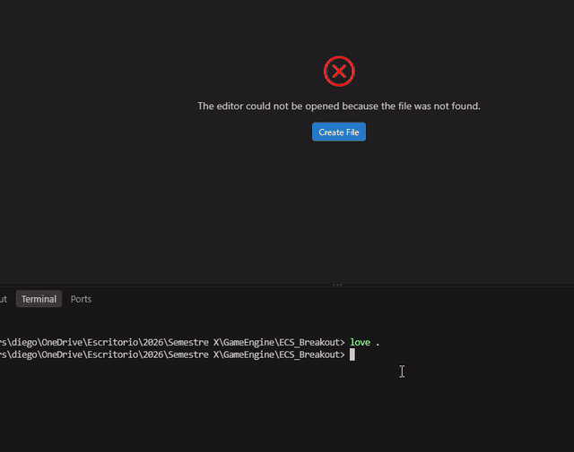

# Breakout ECS

Breakout en [LÖVE](https://love2d.org/) 11.5.

```sh
love .
```

## Demo



## Controles

| Tecla | Acción |
|---|---|
| `A` / `←` | Paddle a la izquierda |
| `D` / `→` | Paddle a la derecha |
| `B` | Lanza una pelota extra |
| `Esc` | Salir |

## Reglas

- El paddle solo se mueve de izquierda a derecha, con movimiento time based (`dt`).
- La pelota siempre está en movimiento.
- Al tocar el **paddle** invierte su movimiento en Y y aumenta su velocidad.
- Al tocar la pared de **arriba o los lados** invierte su movimiento y aumenta su velocidad.
- Al tocar los **bloques** los destruye e invierte su movimiento en Y.
- Si la pelota toca la **pared de abajo** pierdes: se muestra `Game Over` y el juego se cierra.
- Si destruyes todos los bloques ganas: se muestra `You Win!` y el juego se cierra.

La velocidad de la pelota está limitada (`maxSpeed`) para que el juego siga siendo jugable.

## Arquitectura

```
Scene ("breakout")
├── registry   los DATOS: componentes indexados por entidad
│     position, size, velocity, color            (datos)
│     paddle, ball, block, clamp, bounceWalls    (tags / config)
│     match                                      (singleton: estado de la partida)
│     keyPressed, serveRequest, ballBounced      (eventos como entidades)
└── systems    la LÓGICA, en orden de frame
```

Orden de los systems (el orden ES el orden del frame):

| System | Qué hace |
|---|---|
| `InputSystem` | Consume `keyPressed` (Esc, B) |
| `BallSpawnSystem` | Consume `serveRequest` y crea pelotas |
| `PaddleControlSystem` | Crea el paddle; teclado → `velocity.vx` |
| `MovementSystem` | `position += velocity * dt` para toda entidad con ambos |
| `ClampSystem` | Mantiene el paddle dentro de la pantalla |
| `BounceWallsSystem` | Rebote en izquierda/derecha/arriba; emite `ballBounced` |
| `PaddleHitsSystem` | Pelota vs. paddle; emite `ballBounced` |
| `BlockHitsSystem` | Crea los bloques; pelota vs. bloques |
| `BallSpeedSystem` | Consume `ballBounced` y acelera la pelota |
| `MatchSystem` | Estado de la partida: gana / pierde / cierra el juego |
| `RenderSystem` | Dibuja toda entidad con `position + size + color` y la UI |

Los systems no se llaman entre sí: se comunican escribiendo datos en el registry
(por ejemplo, una colisión crea una entidad `ballBounced` y `BallSpeedSystem` la consume).
`main.lua` no tiene lógica de juego: arma la escena y reenvía los callbacks de LÖVE.

```
main.lua
conf.lua
src/
├── Collision.lua        AABB compartido
├── ecs/
│   ├── Registry.lua
│   └── Scene.lua
└── systems/             un archivo por system, nombre de archivo = nombre del módulo
```
